<p align="center">
  
</p>

# POLARIS — Integrated Polar Science Outreach, Knowledge Repository & Media Dissemination Portal

**Smart India Hackathon 2026 · Problem Statement 26063** · Ministry of Earth Sciences (MoES) ·
National Centre for Polar and Ocean Research (NCPOR) · Theme: **Smart Education** · Team Pehchaan

POLARIS is one home for India's polar science. Researchers upload expedition reports,
datasets, publications, photographs, videos and institutional activities. POLARIS places
each record on the map, links it to its station, expedition and related work, and makes it
searchable once a reviewer approves it. **Ask POLARIS** answers questions from those
records with an open-source language model, citing every record it used. From any record,
POLARIS writes website and social media posts that are fact-checked against the record and
credited to the researcher who shared it.

| | |
|---|---|
| Live portal | https://polaris2-ecru.vercel.app |
| Ask POLARIS | https://polaris2-ecru.vercel.app/ask |
| Deployment (Vercel, Docker, Render, Android) | [DEPLOY.md](DEPLOY.md) |
| Configuration | [.env.example](.env.example) |

## Demo sign-in

Open the live portal (or the Android app) and sign in. The sign-in page also lists these
accounts; tap one to fill the form.

| Role | Username | Password | What you can do |
|---|---|---|---|
| Contributor | `user1` | `1234` | Upload work, review the suggested mapping, generate posts from your records, see your public profile |
| Admin | `admin` | `0786` | Everything above, plus approve submissions, review and publish posts, manage accounts and roles, see usage and the RAG index |

These are shared demonstration accounts. Please do not change their roles, so the next
person can sign in too. New accounts created at `/login` start as contributors.

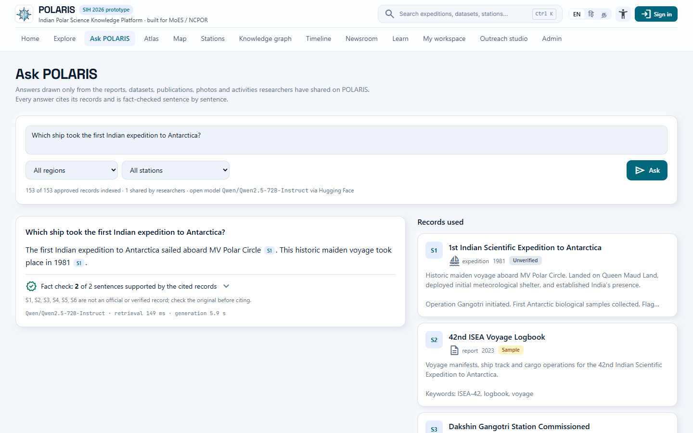

---

## Contents

1. [What POLARIS does](#what-polaris-does)
2. [From a researcher's upload to a published post](#from-a-researchers-upload-to-a-published-post)
3. [Ask POLARIS (RAG)](#ask-polaris-rag)
4. [Trust, provenance and honest labels](#trust-provenance-and-honest-labels)
5. [Screens](#screens)
6. [Architecture](#architecture)
7. [Security](#security)
8. [Run it](#run-it)
9. [Deploy](#deploy)
10. [API](#api)
11. [Repository layout](#repository-layout)
12. [What is not built](#what-is-not-built)

---

## What POLARIS does

| Need in the problem statement | What POLARIS does | How |
|---|---|---|
| **Archive** expedition reports, datasets, publications, photos, videos, activities | One archive with seven record types; uploads up to 100 MB (images, MP4/WebM, PDF, CSV, NetCDF, JSON, TXT) | `archive_items` in PostgreSQL; uploads on disk or Vercel Blob |
| **Map** the material | Every record with a place appears on polar, Himalaya and world maps; station pages show records as hotspots on a 3D model | Station coordinates, uploaded GPS, Natural Earth coastlines, React Three Fiber |
| **Link** related work | Suggested station, region and related records for each upload; a knowledge graph of stations, expeditions, datasets and publications | Nearest station, full-text matching, `item_links` relations (`documents`, `uses_data`, `collected_during`, …) |
| **Find** it again | Full-text search with region, station, year, theme, type and data-status filters; questions answered with citations | PostgreSQL `tsvector` + GIN; pgvector RAG |
| **Generate content** for websites and social media | Website article, X, LinkedIn and Instagram posts from any record | Template generator + sentence-level claim check |
| **For the respective users, per their uploaded work** | Posts and records are credited to the contributor and shown on their public profile and in the newsroom | Accounts, roles, contributor pages |
| **Outreach and education** | Timeline of 45 expeditions, lesson packs and a quiz, live station weather, climate history since 1981 | Database-generated lessons; Open-Meteo forecast and ERA5 reanalysis |

The archive on the live portal holds **153 approved records**: 84 publications, 48 datasets,
8 expeditions, 7 photographs, 3 reports, 2 activities and 1 video, across 6 stations
(Bharati, Maitri, Dakshin Gangotri, Himadri, Himansh, ORV Sagar Kanya). The interface is
available in English, Hindi and Tamil.

---

## From a researcher's upload to a published post

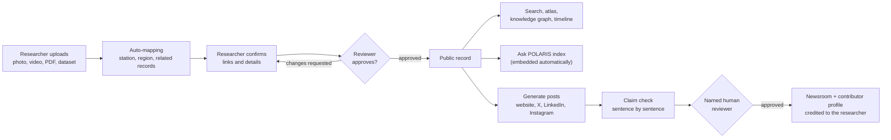

| Step | What happens |
|---|---|
| 1. Share | In **My workspace**, a contributor uploads a file (or takes a photo on the phone and attaches its GPS position) and describes it. |
| 2. Auto-map | POLARIS suggests the station (nearest to the coordinates, or named in the text), the region, and related records with a relation for each. The contributor ticks the right ones. |
| 3. Review | The record stays private until a reviewer approves it, asks for changes or rejects it, with a note the contributor sees. |
| 4. Publish the record | Approved records appear in search, the atlas, the knowledge graph, station pages and the timeline, and are embedded for Ask POLARIS. |
| 5. Generate content | From the record, the contributor or the outreach team generates a website article and X / LinkedIn / Instagram posts. |
| 6. Fact check | Every sentence of a post is compared with the record: shared words and exact numbers. Unsupported sentences block approval unless a reviewer explains why. |
| 7. Publish the post | A named reviewer approves it in the **Outreach studio**; it then appears in the public **Newsroom** and on the contributor's profile at `/contributors/<id>`. Nothing is published automatically. |

Roles: `contributor` → `reviewer` (approves records and posts) → `admin` (also manages accounts).

---

## Ask POLARIS (RAG)

`/ask` answers questions using only the records researchers have shared on the portal, and
names who shared them.

| Step | What happens | How |
|---|---|---|
| 1. Index | Every approved record is split into ~900-character chunks and embedded. The text inside uploaded PDF, TXT, CSV and JSON files is indexed with its record. | `BAAI/bge-small-en-v1.5` (384 dimensions) → pgvector, HNSW index (`server/rag/indexer.ts`) |
| 2. Keep it current | A content hash per record re-embeds edited records, adds newly approved ones and removes unpublished ones, before the next question. | `rag_index_state` |
| 3. Retrieve | Vector similarity and keyword search together, with a relevance floor: off-topic questions get no sources and no answer. | pgvector cosine + PostgreSQL full-text (`server/rag/ask.ts`) |
| 4. Answer | An open model answers only from the retrieved records, cites them as `[S1]`, copies numbers exactly, and says when the archive does not have the answer. | Qwen2.5 (see below) |
| 5. Check | Every sentence is compared with the records it cites. The page shows how many sentences are supported, which records are not official or verified, and who contributed each record. | `server/claims.ts` |

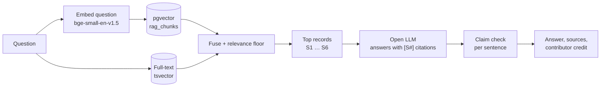

**Models.** All models are open and come from Hugging Face. Two backends share one index:

| | Local (PC, Docker, Android via the PC) | Hosted (Vercel) |
|---|---|---|
| Embeddings | `Xenova/bge-small-en-v1.5` (ONNX port of the same weights) | `BAAI/bge-small-en-v1.5` |
| Answers | `onnx-community/Qwen2.5-1.5B-Instruct`, 4-bit | `Qwen/Qwen2.5-72B-Instruct` (then `openai/gpt-oss-20b`, `Qwen/Qwen2.5-7B-Instruct` if a model is not served on the account) |
| Runs on | Inside the Node server (transformers.js, ONNX Runtime CPU); nothing leaves the machine | Hugging Face Inference Providers (`HF_TOKEN`) |
| Measured | Retrieval ~1–2 s, answer ~10–30 s (about 6 tokens/s on a laptop i9) | Retrieval ~150 ms, answer ~3–6 s |

Without a language model (`RAG_LLM=off`, or the service unavailable), Ask POLARIS still
returns the best-matching sentences from the records, cited.

**Tested questions** on the live portal:

| Question | Result |
|---|---|
| Which ship took the first Indian expedition to Antarctica? | "MV Polar Circle … 1981", cited [S1], 2 of 2 sentences supported |
| What atmospheric studies were conducted at Maitri? | Aerosol, ozone, boundary layer and black-carbon studies, cited to four records |
| Who won the cricket world cup in 2011? | No matching record; the model is not called |

---

## Trust, provenance and honest labels

Every record carries a **data status**, shown as a badge everywhere it appears:

| Status | Meaning |
|---|---|
| `OFFICIAL` / `VERIFIED` | Confirmed by NCPOR or a reviewer |
| `EXTERNAL` ("Open registry") | Real metadata from Crossref (NCPOR-affiliated articles) or PANGAEA (polar datasets); the data stays with the publisher and "Get the data" links to the DOI |
| `SAMPLE` | Demo record written for the prototype |
| `SYNTHETIC` | Demo dataset; its download is a small generated extract labelled `SYNTHETIC SAMPLE EXTRACT` inside the file |
| `UNVERIFIED` | Contributed, not yet confirmed |

- **Live conditions** on station pages come from the Open-Meteo forecast model at the station
  coordinates and are labelled as model values, not instrument readings.
- **Climate history** (daily, 1981 to about a week ago) comes from the ERA5 reanalysis and
  downloads as CSV.
- **Review gates**: contributor records are private until approved; posts need a named human
  reviewer; Ask POLARIS only reads approved records.
- **Provenance**: who reviewed a record, when, and the decision are stored with it.

---

## Screens

| Home | Explore |
|---|---|
| 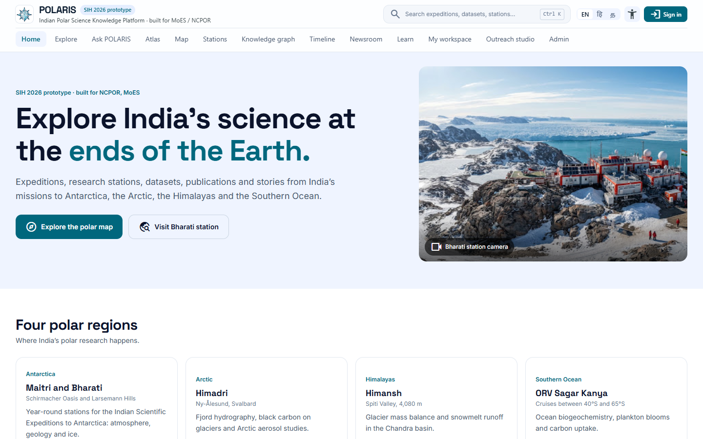 | 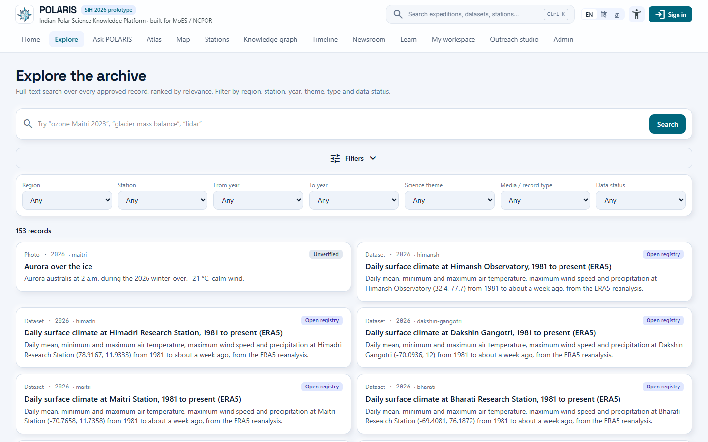 |

**Station page**: a conceptual 3D model with every dataset, report and publication recorded
at the station as a hotspot, live conditions and climate history.

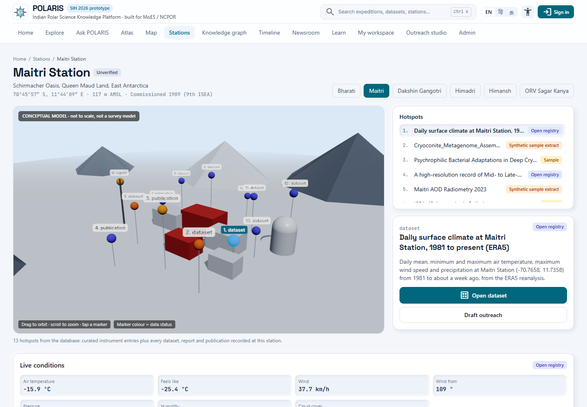

| Data atlas | Knowledge graph |
|---|---|
| 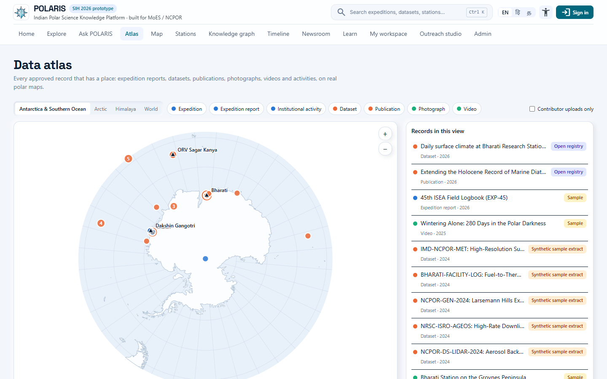 | 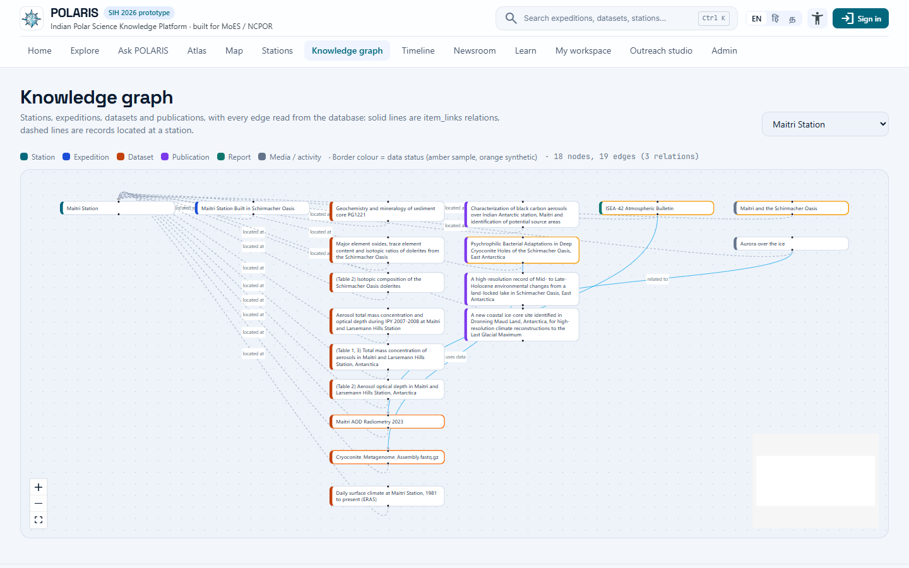 |

| Timeline | Learn |
|---|---|
| 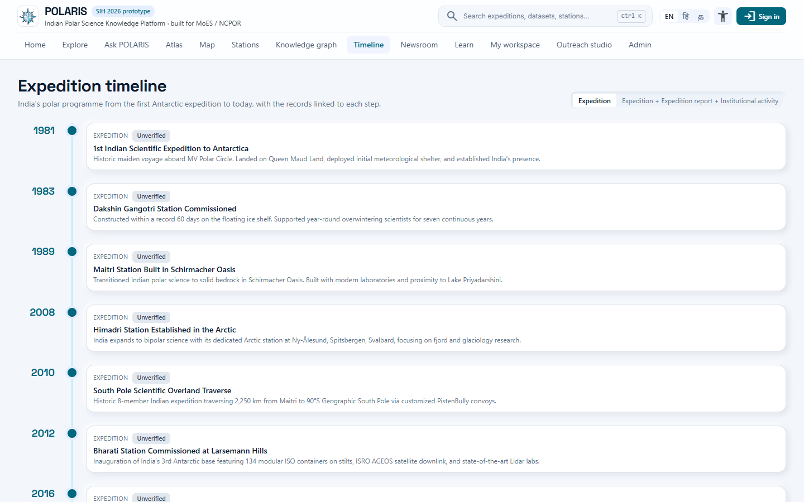 | 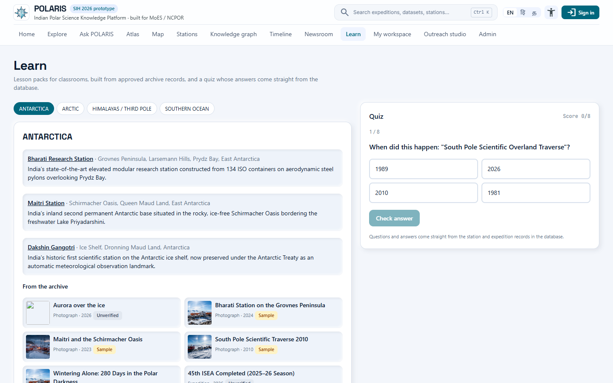 |

| My workspace (contributor) | Outreach studio (reviewer) |
|---|---|
| 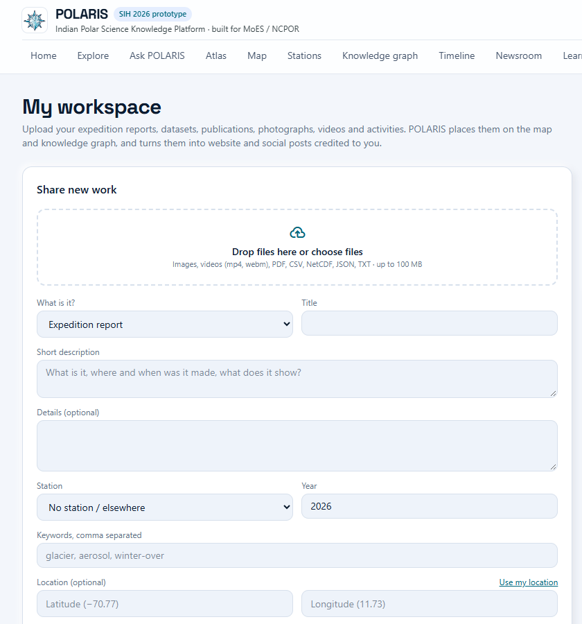 | 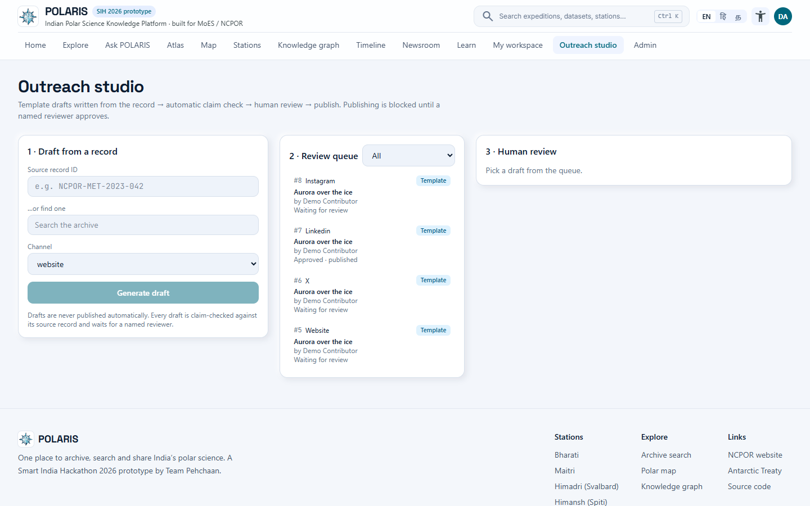 |

**Admin**: contributor submissions, usage analytics, accounts and roles, database status
and the Ask POLARIS index.

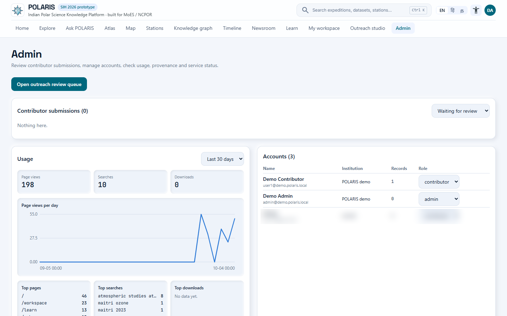

**On a phone**: bottom tab bar, full-screen dialogs, camera capture and location in the
workspace. The same screens ship in the Android app.

<p>
  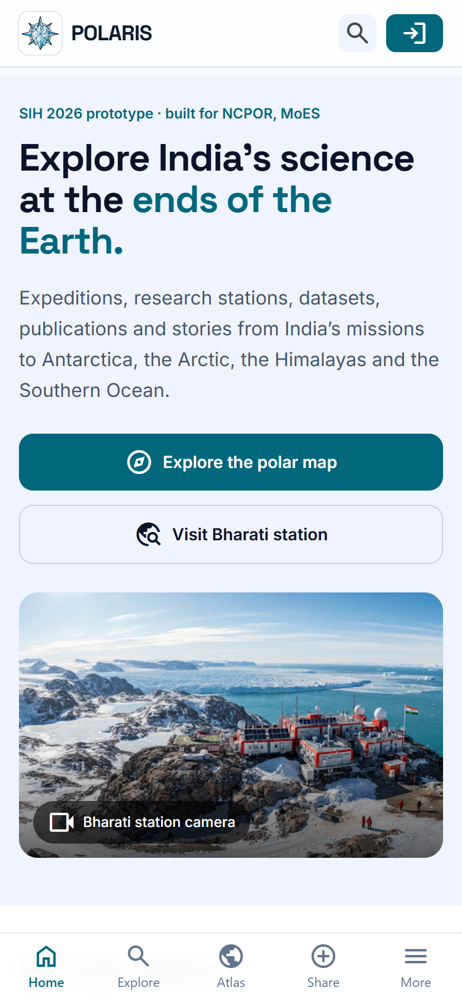
  &nbsp;
  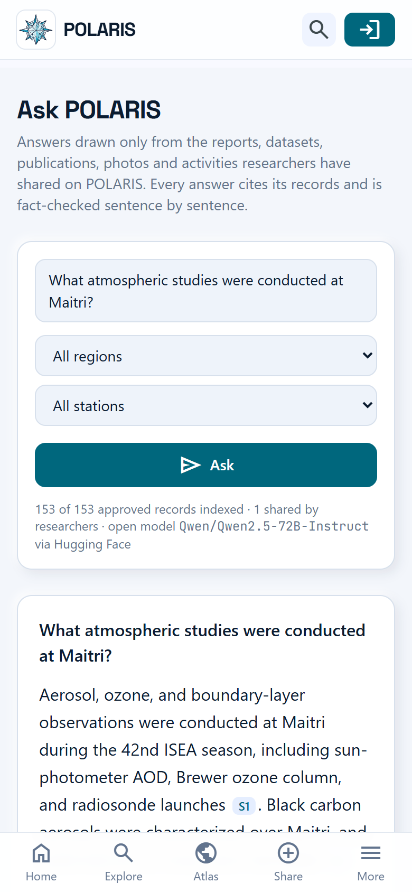
</p>

---

## Architecture

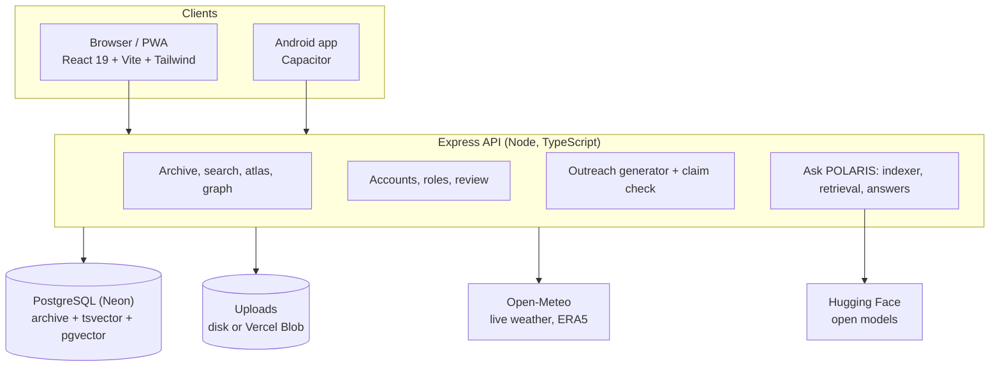

| Part | Stack |
|---|---|
| Frontend | React 19, TypeScript, Vite 8, Tailwind 4, React Router, React Three Fiber, React Flow, d3-geo |
| API | Express 4 on Node 22+, `pg`, one process locally or one Vercel function |
| Database | PostgreSQL with full-text search (`tsvector`, GIN) and pgvector (HNSW); tested on Neon (PostgreSQL 18) |
| RAG | transformers.js + ONNX Runtime (local) or Hugging Face Inference Providers (hosted), `unpdf` for PDF text |
| Android | Capacitor 8 shell with native downloads, camera, location and clipboard |
| Hosting | Vercel (static app + one function), or Docker / Render (`Dockerfile`, `render.yaml`) |

**One archive, seven record types.** `expedition`, `report`, `dataset`, `publication`,
`photo`, `video` and `activity` all live in `archive_items`, so search, linking, metadata
export, outreach and Ask POLARIS work the same way for every kind of record.

---

## Security

| Area | Control | Where |
|---|---|---|
| Passwords | scrypt hashes; length limits | `server/auth.ts` |
| Sessions | Random token in an `HttpOnly`, `SameSite` cookie (`Secure` over HTTPS); only a SHA-256 of the token is stored; malformed cookies are treated as signed out | `server/auth.ts` |
| Roles | `contributor`, `reviewer`, `admin`, checked on the server for every route; contributors only see and edit their own unpublished records | `server/auth.ts`, `server/contrib.ts` |
| Review | Records and posts are published only by a named reviewer; the reviewer name comes from the signed-in account | `server/api.ts` |
| Uploads | Allow-listed file types, 100 MB limit, generated file names, `dotfiles` denied | `server/uploads.ts` |
| Input | Length and format checks on every field; station ids, URLs and coordinates validated | `server/http.ts`, `server/contrib.ts` |
| Abuse | Per-client rate limits on sign-in, proposals and Ask POLARIS, with the real client IP behind Vercel / Render proxies | `server/http.ts`, `server/app.ts` |
| Redirects | Sign-in `?next=` accepts same-site paths only | `src/pages/LoginPage.tsx` |
| Secrets | `DATABASE_URL`, `ADMIN_TOKEN`, `HF_TOKEN` only in environment variables; `.env` is git-ignored | `.env.example` |

---

## Run it

Requirements: **Node.js 22.13+** and a **PostgreSQL** database with pgvector (a free Neon
project works).

```bash
npm install
cp .env.example .env      # set DATABASE_URL
npm run dev               # http://localhost:3000
```

On Windows, `start_all.bat` does the same, pulls the latest code from GitHub, and prints
the address the Android app can use on the same Wi-Fi.

On first start the server creates the tables, seeds the archive and loads the open-data
records. If `ADMIN_TOKEN` is not set, a random admin token is printed in the server log.

**Ask POLARIS locally**: download the open models once (about 1.8 GB, resumable):

```bash
npm run rag:models
```

The index builds itself on startup. To use Hugging Face instead of local models, set
`HF_TOKEN` and `RAG_BACKEND=hosted`.

| Script | What it does |
|---|---|
| `npm run dev` | Express API + Vite dev server on one port |
| `npm run build` | Production frontend build into `dist/` |
| `NODE_ENV=production npm start` | Serves the API and `dist/` |
| `npm run lint` | Type-check frontend and server |
| `npm run rag:models` | Download the local RAG models into `data/models` |
| `npm run import:open-data` | Refresh `server/data/open-data.json` from Crossref + PANGAEA |
| `npm run vercel-build` | Build output for Vercel (static app + API function) |
| `npm run android:apk` | Build the Android app |

---

## Deploy

**Vercel** (the live portal): import the repository; `vercel.json` builds the app and the
API function. Environment variables:

| Variable | Needed for |
|---|---|
| `DATABASE_URL` | Everything (PostgreSQL with pgvector) |
| `HF_TOKEN` | Ask POLARIS (a Hugging Face token with "Make calls to Inference Providers") |
| `ADMIN_TOKEN` | Admin access with a token (optional when admin accounts exist) |
| `BLOB_READ_WRITE_TOKEN` | Uploads on Vercel (connect a Vercel Blob store) |
| `DEMO_ACCOUNTS` | `on` to create the demo logins, `off` for a real deployment |

**Docker / Render**: `Dockerfile` and `render.yaml` run the same server with a disk for
uploads. Details in [DEPLOY.md](DEPLOY.md).

**Android app**: `android/` is a Capacitor project. The app opens the POLARIS server
(the hosted portal, or a PC on the same Wi-Fi) and adds native file downloads, camera
capture, location, clipboard and the back button. Build with `npm run android:apk`
(JDK 21 and the Android SDK); set `POLARIS_SERVER_URL` to make the hosted portal the
default. The server address can be changed in the app.

---

## API

Public:

| Method & path | Purpose |
|---|---|
| `GET /api/health` | Liveness, database and record count |
| `GET /api/bootstrap` | Stations, hotspots, milestones, papers, simulations (first paint) |
| `GET /api/stations` · `/api/stations/:id` | Stations with live conditions and archive counts |
| `GET /api/stations/:id/weather` · `/climate` | Open-Meteo live conditions · ERA5 daily history |
| `GET /api/archive?type=&domain=&station=&year=&theme=&q=` | Browse and filter approved records |
| `GET /api/archive/:id` | One record with its linked records |
| `GET /api/archive/:id/cite?format=apa\|bibtex\|ris` | Citation |
| `GET /api/archive/:id/metadata.json` | ISO 19115-style metadata |
| `GET /api/search?q=` | Ranked full-text search with highlighted snippets |
| `GET /api/facets` · `/api/atlas` · `/api/graph` · `/api/learn` | Filters, map points, knowledge graph, lessons and quiz |
| `GET /api/content/published` | Newsroom posts |
| `GET /api/rag/status` | Ask POLARIS backend, models and index size |
| `POST /api/rag/ask` | `{ question, filters? }` → server-sent events: `sources`, `token`…, `done` (answer, citations, claim check) |

Signed in:

| Method & path | Purpose |
|---|---|
| `POST /api/auth/register` · `/login` · `/logout` · `GET /api/auth/me` | Accounts |
| `POST /api/me/uploads` · `/api/me/suggest` | Upload a file · suggested station, region and links |
| `GET` · `POST /api/me/records` · `PATCH` · `DELETE /api/me/records/:id` | Contributor records |
| `POST /api/me/records/:id/content` · `GET /api/me/content` | Generate and list the contributor's posts |
| `GET /api/admin/submissions` · `POST /api/admin/archive/:id/review` | Review contributor submissions (reviewer) |
| `POST /api/admin/outreach/draft` · `PATCH /api/admin/outreach/:id` | Draft, approve, publish posts (reviewer) |
| `POST /api/admin/rag/reindex` | Index new records, or `{ "full": true }` to rebuild (reviewer) |
| `GET /api/admin/overview` · `/api/admin/users` | Status and accounts (admin) |

---

## Repository layout

```
src/                         React app
  pages/                     Ask, Explore, Atlas, Station, Knowledge graph, Timeline, Learn,
                             Newsroom, Workspace, Outreach studio, Admin, Login
  components/                header, mobile navigation, modals, charts, 3D station scene
  lib/                       API client, auth, i18n (English, Hindi, Tamil)
server/                      Express API
  app.ts, api.ts             app setup and routes
  pg.ts, db.ts, seed.ts      PostgreSQL pool, schema, first-run seed
  search.ts                  full-text search and filters
  auth.ts, contrib.ts        accounts, roles, contributor workspace and auto-mapping
  outreach.ts, claims.ts     post generator and sentence-level claim check
  rag/                       Ask POLARIS: config, models, indexer, retrieval and answers
  openData.ts, realdata.ts   Crossref / PANGAEA records, Open-Meteo and ERA5
  files.ts, extras.ts        downloads, citations, atlas, lessons, usage counters
  uploads.ts, vercel.ts      uploads (disk or Vercel Blob), Vercel function entry
android/, mobile-shell/      Android app (Capacitor) and its launcher page
scripts/                     rag-models.ts, vercel-build.mjs, import-open-data.ts, android-config.mjs
public/                      emblem, PWA manifest and service worker
docs/screenshots/            screenshots used in this README
```

Model files (`data/models`), uploads, build output and `.env` are not in the repository.

---

## What is not built

| Area | Actual state |
|---|---|
| Real NCPOR data | Seeded datasets, reports, photos and the video are demo records labelled `SAMPLE` / `SYNTHETIC`. Publications and PANGAEA datasets are real metadata (`EXTERNAL`); the archive does not hold the full data files or papers. |
| Uploads on Vercel | Need a Vercel Blob store (`BLOB_READ_WRITE_TOKEN`); it is not connected on the live portal yet, so files uploaded elsewhere do not show there. |
| Ask POLARIS quality | Answers are only as good as the records. Locally the 1.5B model sometimes includes a loosely related record; the claim check marks such sentences "partly supported". Questions in Hindi or Tamil are not tuned. |
| Free model usage | The hosted backend uses the Hugging Face free monthly allowance; beyond it, answers fall back to quoted sentences. |
| Accounts | No email verification or password reset. |
| Social networks | Posts are copied or opened in the network's share dialog; there is no direct posting. |
| Translation | Interface in English, Hindi and Tamil; record content and posts stay in the language they were written in. Hindi and Tamil strings need review by native speakers. |
| Android app | Tested on an Android 15 emulator, not yet on a physical phone. |
